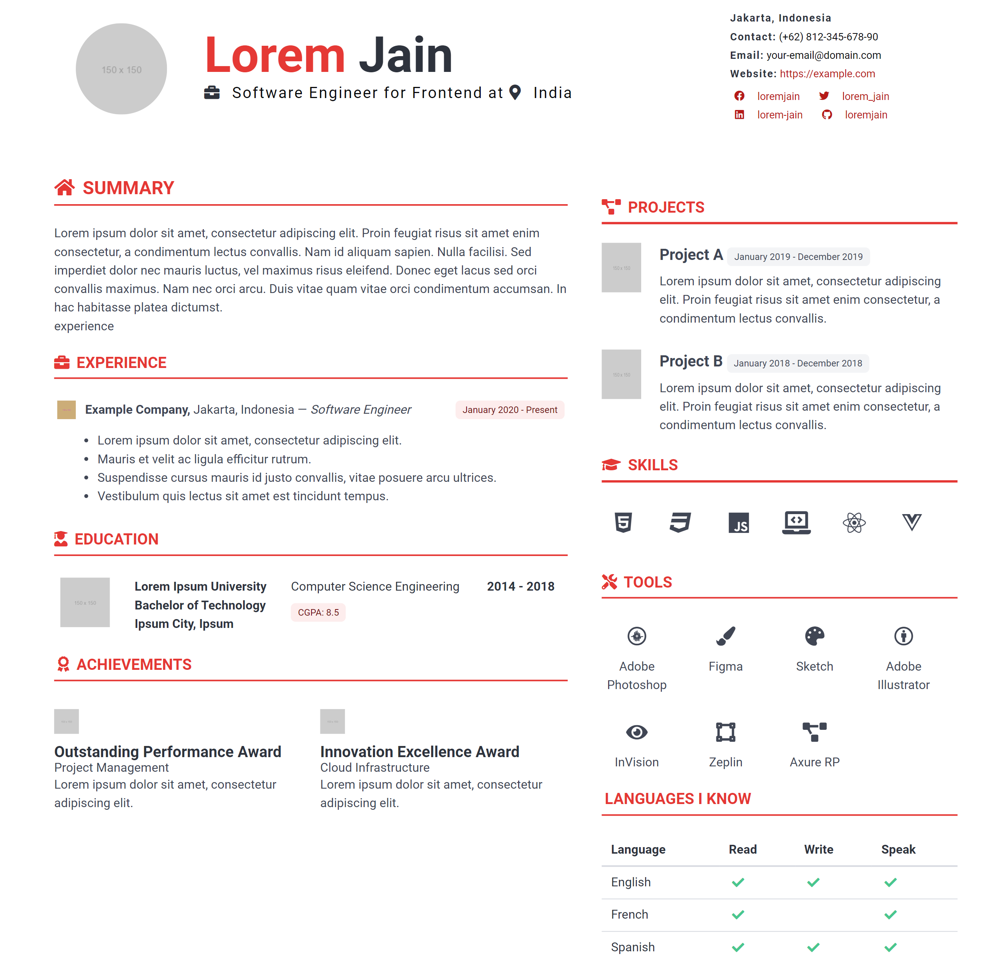

# im-resume

im-resume is a customizable Jekyll theme template built with the Bulma framework, designed for creating stylish resumes.

## Features

- Clean and minimalistic design.
- Fully responsive layout using Bulma CSS framework.
- Easy customization via `_config.yml`.
- Includes sections for personal information, skills, experience, education, projects, and more.
- Integrated Font Awesome icons for skills and social media.
- Optimized for fast loading and SEO-friendly.

Documentation
-- Coming Soon 

License
This project is licensed under the MIT License. See the LICENSE file for more details.